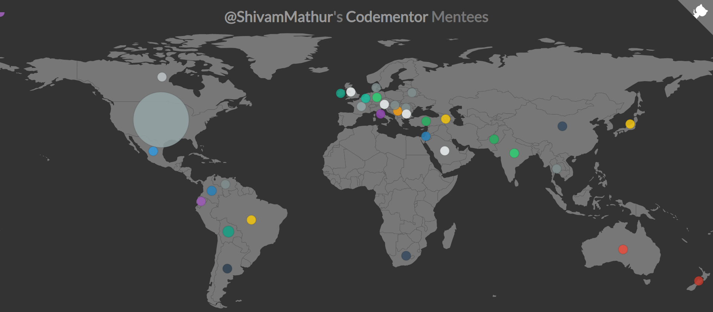

# Codementor Mentees

**Live** - https://shivammathur.github.io/codementor-mentees/

It's so nice to talk with people from different countries, with different beliefs and philosophies, coming from different classes and cultures but wanting having one goal: to learn coding (or fixing their existing app).
I do this on [Codementor.io](https://codementor.io/shivammathur).

## How I created this

This project is a fork of Ionică Bizău's [project](https://github.com/IonicaBizau/my-mentees). So most parts of the front-end are taken from his project, I just tuned it to my liking. The data-collection part I coded myself.

## Data
Data is collected from codementor API. Codementor has two modes of help, live sessions and offline help. That data for both those modes is collected in two json files from codementor API (not sharing those).

For each offline help or live session user-id of the mentee and their timezones are extracted. Codementor does not ask people for their countries but their timezones. Next timeszones are converted into countries by geocoding. 

The user-ids have been anonymized. The main reason for making the user-ids anonymous is mainly to preserve the mentee's privacy (I'm not interested to visualize their identity on the map). However, I do want to know how many sessions I had with a specific mentee. Hence, the *anonymized user ids*.

All this data refining code is in `data/data.py`
